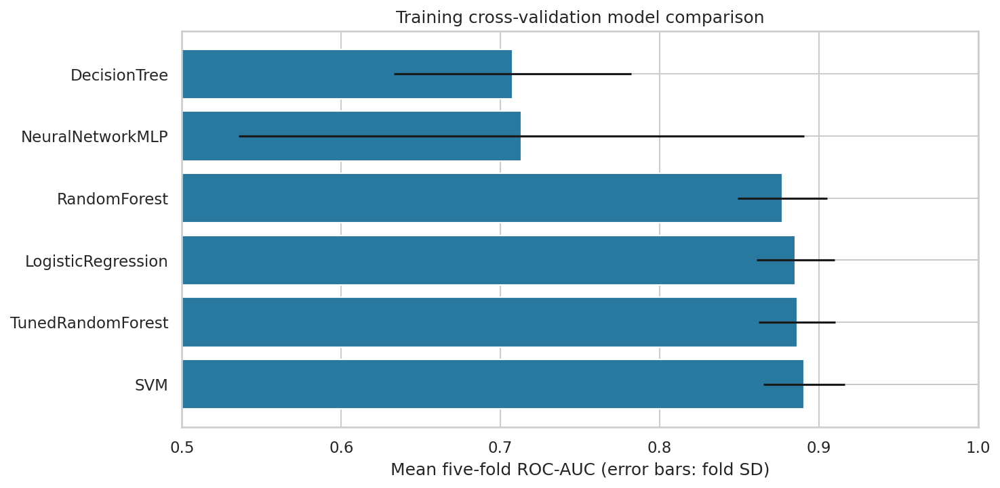
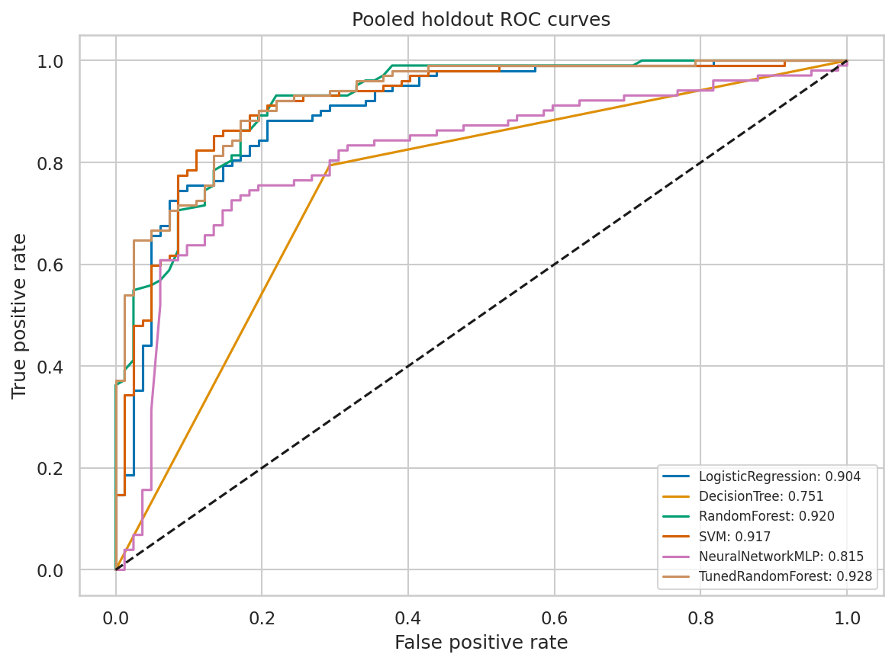
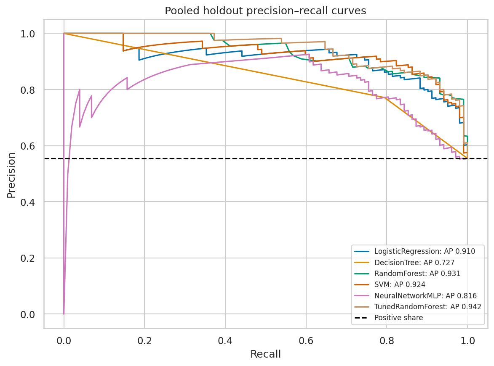
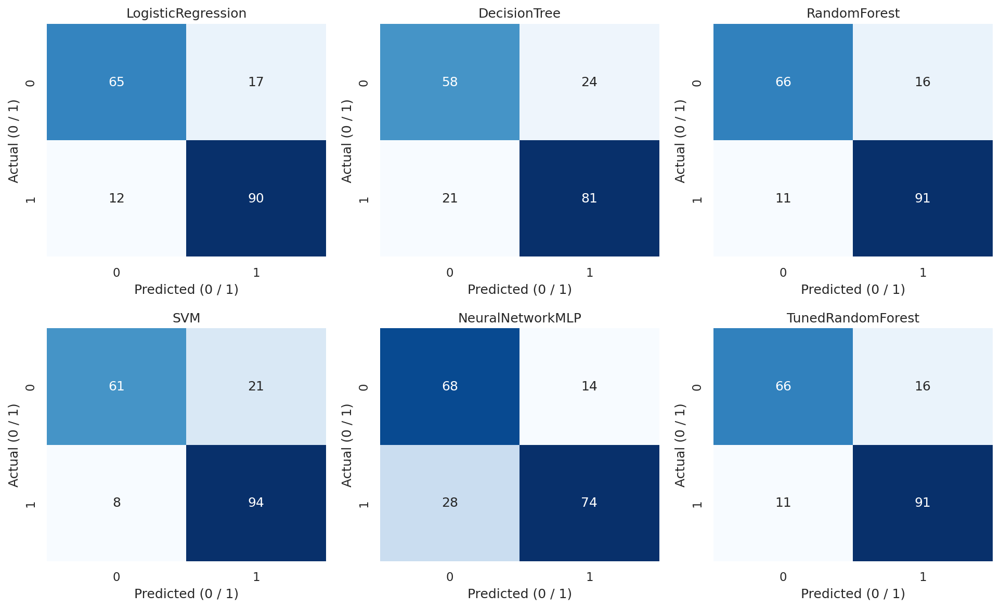
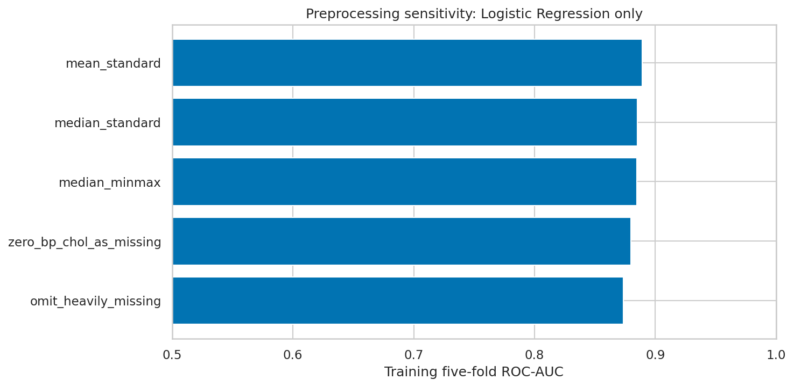
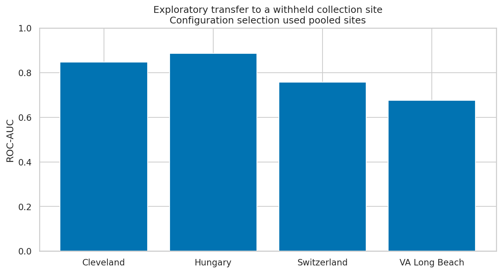
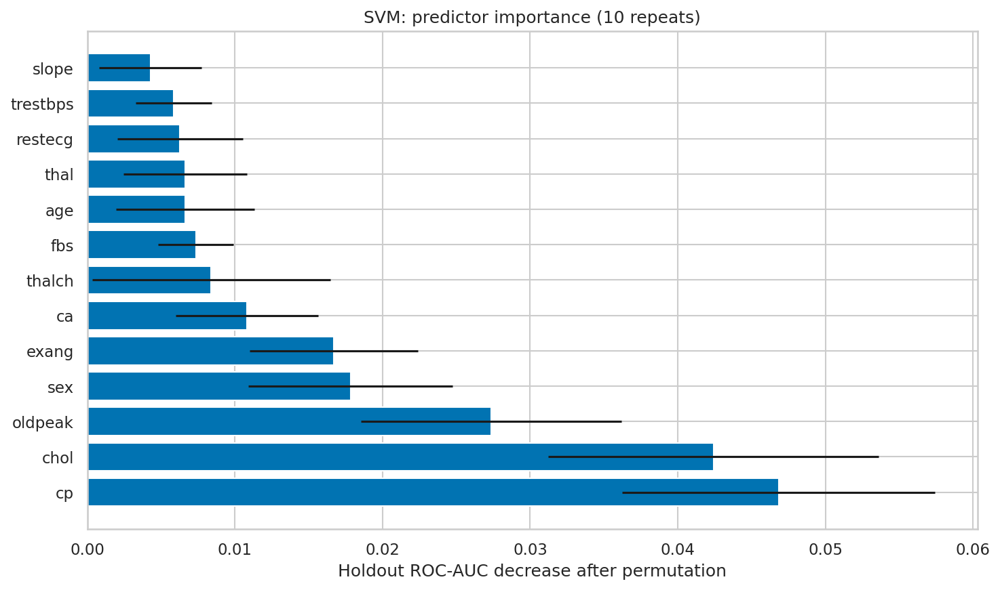
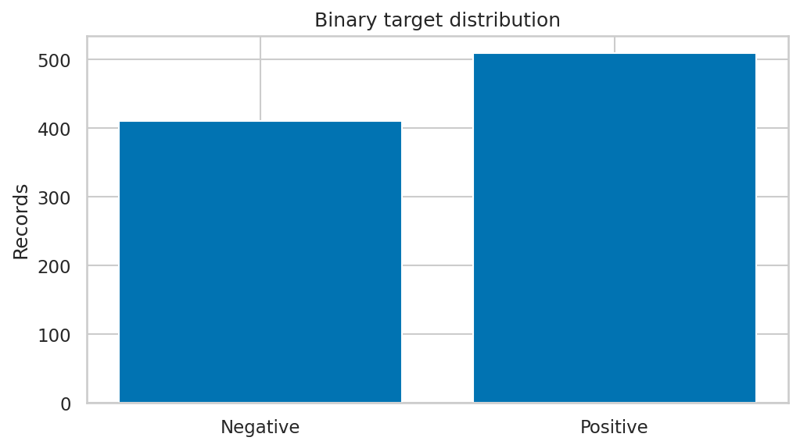
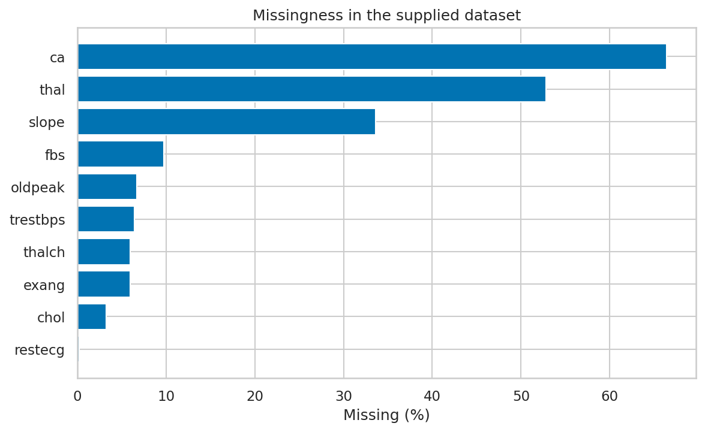

# Heart Disease Classification Using Machine Learning

A Python project comparing machine-learning algorithms for classifying the presence or absence of heart disease in a historical UCI-derived dataset. It covers data exploration, training-fold preprocessing, model comparison, Random Forest tuning, and error analysis.

## Project Background and My Contribution

This project was submitted under **Team 8 for AIT 614 at George Mason University**.

I completed the data preparation, exploratory analysis, model implementation, hyperparameter tuning, evaluation, research report, and presentation.

The historical academic submissions retain their team attribution. This repository documents my implementation and subsequent improvements to reproducibility and evaluation.

## Motivation

The project examines how classification algorithms and preprocessing choices perform on structured clinical attributes. The task is to classify **recorded disease status**. It does not establish prediction of future cardiac events or improved patient outcomes.

## Dataset

Source used in the academic project: [UCI Heart Disease Data — Kaggle](https://www.kaggle.com/datasets/redwankarimsony/heart-disease-data). Original source: [UCI Heart Disease](https://doi.org/10.24432/C52P4X).

The supplied combined CSV has **920 records and 16 columns**, including 13 clinical predictors, a record identifier, collection-site labels, and the target.

| Collection-site label | Records |
|---|---:|
| Cleveland | 304 |
| Hungary | 293 |
| VA Long Beach | 200 |
| Switzerland | 123 |
| **Total** | **920** |

The supplied combined dataset differs from UCI's commonly used 303-record Cleveland-only subset.

### Target and Data Quality

`num = 0` is the negative class (**411 records**). `num > 0` is the positive class (**509 records**, 55.33%). The target has no missing values and there are no exact repeated rows.

| Predictor | Missing records | Missing share |
|---|---:|---:|
| ca | 611 | 66.41% |
| thal | 486 | 52.83% |
| slope | 309 | 33.59% |
| fbs | 90 | 9.78% |
| oldpeak | 62 | 6.74% |
| trestbps | 59 | 6.41% |
| thalch | 55 | 5.98% |
| exang | 55 | 5.98% |
| chol | 30 | 3.26% |
| restecg | 2 | 0.22% |

There are **172 zero cholesterol values** and **one zero resting-blood-pressure value**. The main benchmark retains them. A separate training-only sensitivity experiment treats them as missing, without asserting that individual records have been clinically corrected.

See [dataset documentation](data/README.md) for fields and attribution.

## Project Structure

| File or folder | Purpose |
|---|---|
| `OriginalCode.ipynb` | Executed notebook with tables, plots, and reproduction controls |
| `scripts/run_analysis.py` | Portable analysis, model fitting, evaluation, and output generation |
| `scripts/verify.py` | Checks split separation and metrics against saved predictions |
| `requirements.txt` | Python package versions used for execution |
| `data/` | Unchanged source CSV and documentation |
| `results/tables/` | Cross-validation, holdout, tuning, sensitivity, and importance results |
| `results/plots/` | Nine visualizations |
| `results/predictions/` | Holdout labels, scores, predictions, and site labels |
| `results/experiment_summary.json` | Configuration, source checksum, and execution notes |
| `reports/analysis_report.md` | Experiment findings and limitations |
| `docs/` | Historical paper and presentation transcript |

## Models and Evaluation Workflow

Five model families are compared: **Logistic Regression, Decision Tree, Random Forest, SVM, and Neural Network**. A tuned Random Forest is evaluated as an additional configuration.

The revised neural network is a scikit-learn MLP with hidden layers of 10 and 5 units, ReLU activation, Adam optimization, and early stopping. It replaces the original TensorFlow implementation and is not an exact reproduction of that model's scores.

1. Convert the target to binary before predictor preprocessing.
2. Exclude `id` and the collection-site field from predictors.
3. Create a stratified **736-record training set** and **184-record holdout**, with seed 42.
4. Fit numeric median imputation and standardization, categorical mode imputation, and one-hot encoding separately inside each training fold.
5. Compare models with the same five stratified cross-validation folds.
6. Tune Random Forest using **20 randomized configurations**, selected by training CV ROC-AUC.
7. Select the headline model using training CV ROC-AUC and evaluate the holdout at a probability threshold of **0.5**.
8. Run preprocessing sensitivity and exploratory collection-site transfer experiments.

Tuning and model comparison share folds. The CV estimates are not nested and tuned scores may be optimistic. The pooled holdout remains separate from fitting and parameter selection.

## Verified Results

### Training Cross-Validation

| Model | CV ROC-AUC | Fold SD | CV AP | CV accuracy | CV recall |
|---|---|---|---|---|---|
| SVM | 0.8908 | 0.0256 | 0.8902 | 0.8220 | 0.8672 |
| TunedRandomForest | 0.8863 | 0.0239 | 0.8850 | 0.8030 | 0.8427 |
| LogisticRegression | 0.8852 | 0.0245 | 0.8985 | 0.8112 | 0.8451 |
| RandomForest | 0.8771 | 0.0279 | 0.8681 | 0.8030 | 0.8475 |
| NeuralNetworkMLP | 0.7131 | 0.1776 | 0.7478 | 0.6742 | 0.5363 |
| DecisionTree | 0.7074 | 0.0745 | 0.6956 | 0.7105 | 0.7345 |

**SVM** has the highest training CV ROC-AUC (**0.8908**) and is the selected headline model.



### Independent Pooled Holdout

All models use the same 184 holdout records, including 102 positive and 82 negative labels.

| Model | Accuracy | Precision | Recall | Specificity | F1 | ROC-AUC | AP |
|---|---|---|---|---|---|---|---|
| LogisticRegression | 0.8424 | 0.8411 | 0.8824 | 0.7927 | 0.8612 | 0.9035 | 0.9100 |
| DecisionTree | 0.7554 | 0.7714 | 0.7941 | 0.7073 | 0.7826 | 0.7507 | 0.7267 |
| RandomForest | 0.8533 | 0.8505 | 0.8922 | 0.8049 | 0.8708 | 0.9200 | 0.9311 |
| SVM | 0.8424 | 0.8174 | 0.9216 | 0.7439 | 0.8664 | 0.9167 | 0.9240 |
| NeuralNetworkMLP | 0.7717 | 0.8409 | 0.7255 | 0.8293 | 0.7789 | 0.8153 | 0.8159 |
| TunedRandomForest | 0.8533 | 0.8505 | 0.8922 | 0.8049 | 0.8708 | 0.9279 | 0.9424 |

The selected SVM achieves **84.24% accuracy**, **92.16% recall**, **0.9167 ROC-AUC**, and **0.9240 average precision**. At threshold 0.5, it records **94 true positives, 61 true negatives, 21 false positives, and 8 false negatives**.

Tuned Random Forest has the highest holdout ROC-AUC (**0.9279**). This does not change the cross-validation-based selection. Its recall is lower than SVM's and its specificity is higher.







## Research Questions and Answers

### RQ1. How effective are different algorithms on this dataset?

SVM leads under the training CV selection criterion. Tuned Random Forest leads on pooled holdout ROC-AUC. Logistic Regression also performs competitively, with holdout ROC-AUC **0.9035**.

The Decision Tree and the tested MLP configuration perform less well. The MLP's result applies to this small architecture and training configuration; it does not establish that neural networks generally underperform.

Model rankings depend on the metric, and the holdout includes both missed positive labels and false alarms. These are research benchmark results rather than clinical performance guarantees.

### RQ2. Which preprocessing techniques are most effective?

Five alternatives were compared using **Logistic Regression on training records only**, with identical folds:

| Variant | CV ROC-AUC | CV AP | CV accuracy | CV recall |
|---|---|---|---|---|
| median_standard | 0.8852 | 0.8985 | 0.8112 | 0.8451 |
| mean_standard | 0.8892 | 0.9047 | 0.8112 | 0.8426 |
| median_minmax | 0.8846 | 0.8924 | 0.8125 | 0.8450 |
| omit_heavily_missing | 0.8734 | 0.8829 | 0.7894 | 0.8230 |
| zero_bp_chol_as_missing | 0.8797 | 0.8887 | 0.8071 | 0.8449 |

Mean imputation with standardization produces the highest CV ROC-AUC in this limited comparison (**0.8892**, versus **0.8852** for median imputation). The difference is small. Omitting the heavily missing predictors and treating zero cholesterol/blood pressure as missing reduce CV ROC-AUC in this experiment.

The main model comparison uses the predefined median-imputation pipeline. This sensitivity analysis does not establish one universally best preprocessing approach across models or populations.



### RQ3. How do ensemble techniques affect accuracy and robustness?

Random Forest is an ensemble of decision trees. Its tuned configuration improves training CV ROC-AUC from **0.8771 to 0.8863** and holdout ROC-AUC from **0.9200 to 0.9279**.

At threshold 0.5, both Random Forest configurations produce the same holdout confusion counts and therefore the same accuracy, recall, precision, and F1. Their probability rankings differ.

The experiment does not combine different model families into a voting or stacking ensemble, and the small AUC increase does not establish improved robustness.

In a separate exploratory SVM transfer experiment, each collection site is withheld from fitting:

| Withheld site | Fit records | Evaluation records | Accuracy | Recall | Specificity | ROC-AUC |
|---|---|---|---|---|---|---|
| Cleveland | 616 | 304 | 0.7237 | 0.9065 | 0.5697 | 0.8478 |
| Hungary | 627 | 293 | 0.8259 | 0.8396 | 0.8182 | 0.8861 |
| Switzerland | 797 | 123 | 0.8780 | 0.9217 | 0.2500 | 0.7576 |
| VA Long Beach | 720 | 200 | 0.6800 | 0.7248 | 0.5490 | 0.6761 |

ROC-AUC varies from **0.6761 to 0.8861**, indicating sensitivity to collection-site differences. This experiment is exploratory: the SVM configuration was selected using pooled training sites, so these scores are not nested external validation.



### RQ4. Which metrics provide the most useful evaluation?

Recall and false-negative counts describe missed positive labels. Precision and false positives describe false alarms. Specificity describes identification of negative labels. ROC-AUC and average precision evaluate score ranking, while confusion matrices show errors at a chosen threshold.

For example, the selected SVM misses **8 of 102 positive records** but labels **21 of 82 negative records** positive. Tuned Random Forest misses **11 positive records** and produces **16 false positives**. SVM therefore has higher recall while tuned Random Forest has higher specificity.

Accuracy alone hides this tradeoff. All reported classification metrics use threshold 0.5; no clinical operating threshold is claimed.

### RQ5. How can predictions be interpreted?

The selected SVM is examined using holdout permutation importance: each raw predictor is shuffled ten times, measuring the decrease in ROC-AUC.

The largest average decreases are associated with **chest-pain category (`cp`), cholesterol (`chol`), and ST depression (`oldpeak`)**. These describe the fitted model's reliance on the recorded fields, including any missingness or site-related patterns.

Permutation importance is not a causal explanation or a per-patient explanation. Correlated predictors and the small holdout can affect the ranking. See the [importance table](results/tables/permutation_importance.csv) for means and variability.



## What We Achieved

- Built and executed a portable Python classification workflow on **920 records**.
- Compared **five model families and a tuned Random Forest configuration** using shared folds.
- Kept **184 holdout records** separate from fitting and selection.
- Answered five research questions using measured results and explicit limitations.
- Compared five preprocessing alternatives and explored transfer across four collection sites.
- Generated model metrics, tuning results, holdout predictions, and **nine charts**.
- Preserved the historical academic paper and presentation text alongside the revised experiment.





## Historical Results and Changes

The original submitted notebook reported tuned Random Forest accuracy **85.87%**, recall **87.16%**, and ROC-AUC **0.9118**. It fitted preprocessing and selected features before splitting, included record ID, and dropped encoded categorical features during numerical-only selection.

The revised workflow removes those evaluation issues, retains clinical categorical predictors, uses portable paths, consumes the search's returned parameters, and explicitly scores tuning by ROC-AUC.

The original search tested 100 configurations and used the default accuracy scorer. This revision uses 20 configurations and ROC-AUC. The split, predictors, preprocessing, tuning objective, and neural-network implementation differ, so numerical differences are **not an isolated before/after accuracy improvement**.

See [historical metrics](results/tables/historical_metrics.csv) and [historical submissions](docs/README.md). Gradient Boosting is mentioned in the original paper but was not implemented and is not claimed as a completed experiment.

## Running the Project

Tested with Python 3.12. From the repository root:

```bash
python -m venv .venv
# Activate the environment using the command for your operating system.
python -m pip install -r requirements.txt
python scripts/run_analysis.py
python scripts/verify.py
```

Alternatively, run `python -m jupyterlab` and open `OriginalCode.ipynb`. The notebook displays saved results by default. Set `REBUILD = True` in its first code cell to regenerate them using the shared analysis script.

Notebook cells were executed sequentially in a shared IPython process to prepare the saved outputs. This environment blocks Jupyter kernel sockets, so a separate Jupyter kernel launch was not verified here.

## Limitations and Future Work

- The dataset is small, historical, and unevenly distributed across collection sites.
- Several predictors have substantial missingness, and zero-valued measurements require interpretation.
- Results reflect one pooled holdout split. CV tuning uses shared rather than nested folds.
- Site-transfer scores vary and remain exploratory because model configuration selection used pooled sites.
- Neural-network performance applies to one scikit-learn configuration.
- Feature importance does not establish causation or clinical validity.
- Scores classify recorded disease labels and do not demonstrate future-event prediction, prevention, or improved outcomes.

Further work could use nested validation, calibration analysis, more comprehensive neural-network tuning, independent cohorts, and validation of measurement conventions.

## Conclusion

The revised experiment selects SVM by training CV ROC-AUC. It achieves **0.9167 holdout ROC-AUC** and **92.16% recall**, with eight missed positive labels and 21 false positives. Tuned Random Forest achieves higher holdout ROC-AUC and specificity, illustrating why several metrics are needed.

Preprocessing changes produce modest differences in the limited Logistic Regression comparison. Performance varies across collection sites, limiting broader generalization claims. The project provides reproducible classification experiments, transparent error counts, and research answers supported by the implemented analysis.

This is an academic machine-learning project. Clinical use has not been validated.
